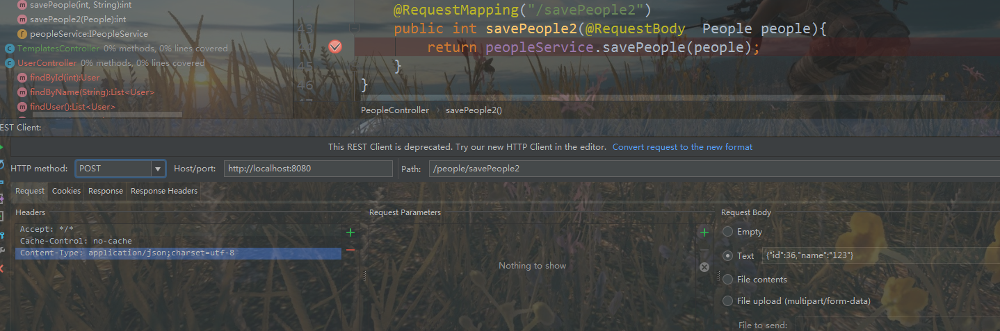

# springboot learn

### dept1           

  了解JAVA配置,java配置是spring3+推荐的配置方式，可以完全替换xml配置，并且结构更加的清晰。

spring的java配置方式是通过@Configuration和@Bean这两个注解完成的：

1、  @Configuration 作用于类上，相当于一个xml配置文件;

2、 @Bean 作用于方法上，相当于xml配置中的<bean>；


但是大多数情况使用java配置+注解


### dept2

  读取外部的资源配置文件，通过@PropertySource可以指定读取的配置文件，通过@Value注解获取值

```java
@PropertySource(value= {"classpath:jdbc.properties"})
public class SpringConfig {
    @Value("${jdbc.url}")
    private String jdbcUrl;  
    ...........
}
```

1、读取多个配置文件

```java
@PropertySource(value= {"classpath:jdbc.properties","xxx.properties"})
```

2、如果配置文件不存在

```java
@PropertySource(value= {"classpath:jdbc.properties","xxx.properties"},ignoreResourceNotFound =true)
```


### dept3

 @profile  动态注册bean   开发环境or生产环境

 @conditional 条件注解   以不同操作系统作为条件，重写Condition接口，并重写其matches方法来构造判断条件。


### dept4

   com.dept : 使用java配置快速搭建Spring MVC项目

### dept5

​    com.dept:  Spring MVC 基本配置

   Spring MVC的定制配置需要我们配置的类继承一个WebMvcConfigurerAdapter类（但是我用的版本spring5显示已过时，我改用WebMvcConfigurationSupport类），并在此类使用@EnableWebMvc注解，来开启对Spring MVC的配置支持，这样我们就可以重写这个类的方法，完成我们的常用配置。如：

  拦截器，视图解析器，试图跳转器


  

### dept6

  application.properties配置文件，可在用时，在官网查看


dept1-dept6可参看笔记:springboot_笔记.docx


[Spring Boot Reference Guide](https://docs.spring.io/spring-boot/docs/current/reference/html/index.html "springboot 参考指南")


### dept7

热部署 在pom.xml引入热部署依赖包

* IntelliJ  IDEA加入spring-boot-devtools依赖即可,<optional>true</optional>表示依赖不传递

```java
 <dependency>  
        <groupId>org.springframework.boot</groupId>  
        <artifactId>spring-boot-devtools</artifactId>  
        <optional>true</optional>
 </dependency> 
```


* eclipse 还需要修改一下节点配置(可以参看springboot3样例)

```java
<build>
		<plugins>

			 <plugin> 
			      <groupId>org.springframework.boot</groupId> 
			      <artifactId>spring-boot-maven-plugin</artifactId> 
			        <configuration>
              <!--fork :  如果没有该项配置，devtools不会起作用，即应用不会restart -->
                      <fork>true</fork>
                    </configuration>
				</plugin>
		</plugins>
	</build>
```


在Spring Boot中使用JPA

JPA全称Java Persistence API.JPA通过JDK 5.0注解或XML描述对象－关系表的映射关系，并将运行期的实体对象持久化到数据库中。百度百科JPA

JPA（Java Persistence API）：是Sun官方提出的==Java持久化规范==。它为java开发人员提供了一种对象/关系映射工具来管理Java应用中的关系数据。

Hibernate是一个开放源代码的对象关系映射框架，它对JDBC进行了非常轻量级的对象封装，它将POJO与数据库表建立映射关系，==是一个全自动的orm（对象关系映射）框架==，hibernate可以自动生成SQL语句，自动执行，使得Java程序员可以随心所欲的使用对象编程思维来操纵数据库。 Hibernate可以应用在任何使用JDBC的场合，既可以在Java的客户端程序使用，也可以在Servlet/JSP的Web应用中使用，最具革命意义的是，Hibernate可以在应用EJB的J2EE架构中取代CMP，完成==数据持久化==的重任。

Spring Data是一个==用于简化数据库访问，并支持云服务的开源框架==。其主要目标是使得数据库的访问变得方便快捷，并支持map-reduce框架和云计算数据服务。此外，它还支持基于关系型数据库的数据服务，如Oracle RAC等。对于拥有海量数据的项目，可以用Spring Data来简化项目的开发，就如Spring Framework对JDBC、ORM的支持一样，Spring Data会让数据的访问变得更加方便。

Spring Data JPA能干什么

可以极大的简化JPA的写法，可以在几乎不用写实现的情况下，实现对数据的访问和操作。除了CRUD外，还包括如分页、排序等一些常用的功能。	

首先我们需要清楚的是Spring Data是一个开源框架，在这个框架中Spring Data JPA只是这个框架中的一个模块，所以名称才叫Spring Data JPA。如果单独使用JPA开发，你会发现这个代码量和使用JDBC开发一样有点烦人，所以==Spring Data JPA的出现就是为了简化JPA的写法，让你只需要编写一个接口继承一个类就能实现CRUD操作了==。

==JPA是一种规范，而Hibernate是它的一种实现==。除了Hibernate，还有EclipseLink(曾经的toplink)，OpenJPA等可供选择，所以使用Jpa的一个好处是，可以更换实现而不必改动太多代码。

用法：

```java
1.在pom.xml添加spring-data-jpa依赖、mysql数据库驱动依赖
2.新建application.properties配置文件，配置mysql数据库连接配置信息
3.在application.properties文件中配置JPA配置信息
4.测试
```

 全局异常处理 config>GlobalDefaultExceptionHandler


thymeleaf和freemarker可以并存（如果报错，先注释一个，跑起来后，在解开注释）

spring-boot使用jsp作为模板、集成mybatis参照项目springboot1

 @RequestBody的使用

```java
@RequestMapping("/savePeople2")
    public int savePeople2(@RequestBody  People people){
        return peopleService.savePeople(people);
    }
```



另外需要注意application.properties里面配置jpa生成表字段的策略


整合redis单机版作为缓存


dept8

  整合redis集群（redis-cluster）

spring boot 不同版本，配置不太一样，这里的spring boot 是2.0.3.RELEASE

附：gitee上面有人传了一个spring boot 1.5.9 的redis集群样例

 [spring cluster 1.5.9.RELEASE](https://gitee.com/zhenhai_zheng/springboot_rediscluster.git)

与源码对应的csdn博客

[spring boot整合Redis集群](https://blog.csdn.net/baidu_41669919/article/details/79148203)